## Learning Recommender Systems from Multi-Behavior Data 

IEEE TRANSACTIONS ON KNOWLEDGE AND DATA ENGINEERING, SUBMISSION 2018 

***

### 推荐算法

<u>**基于已知的用户行为数据，对用户未产生的行为进行预测。**</u>

***

### 当前推荐算法的缺陷

大多数现存的推荐系统基于用户的单行为，例如电子商务中的购买，然而有很多其他的用户行为也能为推荐系统提供大量有价值的信息，例如点击量，加入购物车，收藏等等。

***

### 本文提出的推荐算法

**N**eural **M**ulti-**T**ask **R**ecommendation (NMTR)

该算法建立了一种基于多行为数据学习的推荐算法模型，即其从用户的多种行为交互中得到训练；

而且其能够捕捉用户多种行为交互间的级联关系，例如 用户 访问商品->将商品加入购物车->购买；

该算法具备的四个特性：

+ 1.共享的嵌入矩阵
+ 2.为每种行为训练各自的交互函数
+ 3.捕捉多种行为间的级联关系
+ 4.多任务学习

下面从这四个特性对该模型进行讲解：

算法模型：

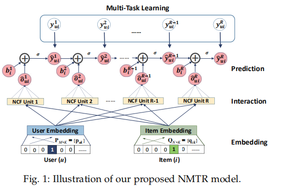

***

#### 共享的嵌入矩阵

##### 什么是embedding？

简单来说，embedding就是用一个低维的向量表示一个物体，该物体可以是一个词，或是一个商品，或是一个电影等等。

###### 理解embedding

    
    
    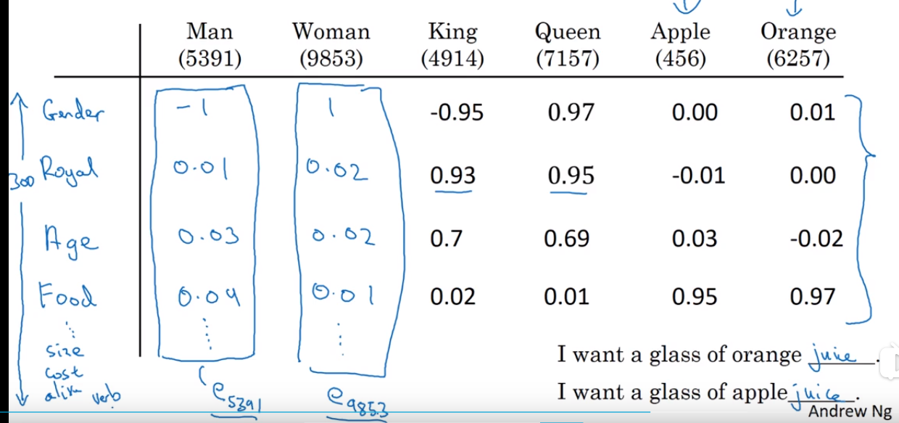 

如果您想更深入地了解请点击[吴恩达深度学习-自然语言处理](https://www.bilibili.com/video/BV1F4411y7BA?p=13)

###### embedding vector 在三维空中的展示

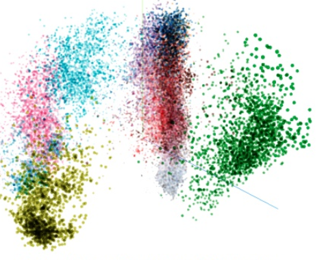

##### 从one-hot到embedding vector

**P** and **Q** are of the size M × E and N × E, respectively, where E denotes the embedding size.

***

#### 为多种行为训练各自的交互函数

针对每个行为使用**NCF(Neural Collaborative Filtering)**单元训练其单独的交互函数；

**NCF**是**针对单行为数据进行协同过滤**的通用神经网络框架；

其模型为：

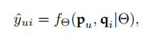

其输入为**用户u**和**商品i**的embedding vector，其输出为<u>用户u对商品i</u>的喜好程度；

本文中使用sigmoid激活函数将该输出转变为<u>用户u与商品i</u>产生交互的可能性：

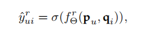

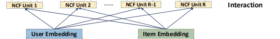

***

#### 捕捉多种行为间的级联关系

在现实生活中多行为间具有确定的时间顺序(例如：某个用户必须看到某一商品后才能购买该商品)；

基于此观察，

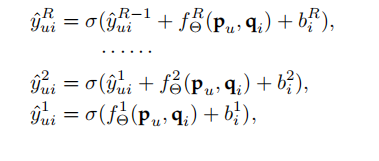

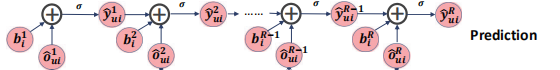

#### 多任务学习

**单行为的目标函数**

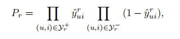

**多行为的目标函数**

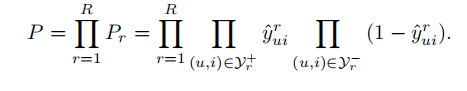

**损失函数**

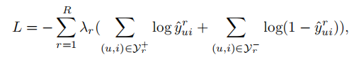

### 与现有方法的比较

#### 度量指标

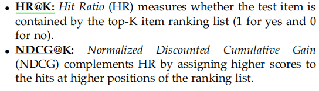

#### 数据集

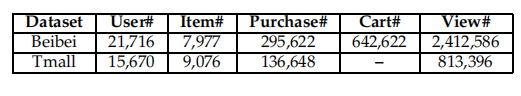

#### 比较

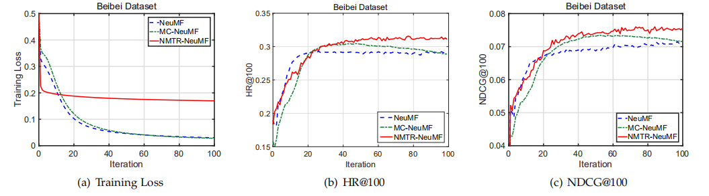

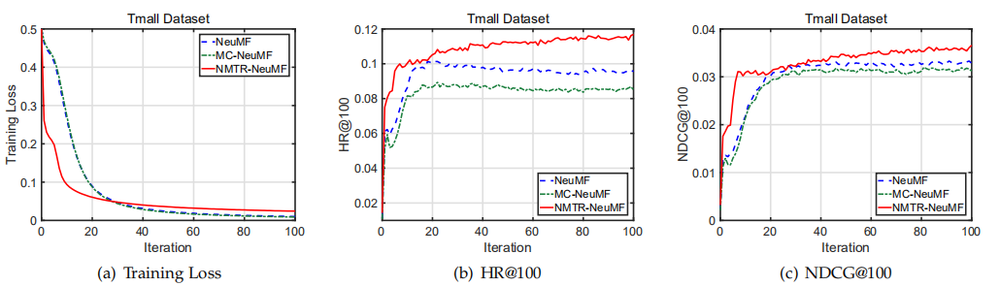

##### 针对冷启动问题

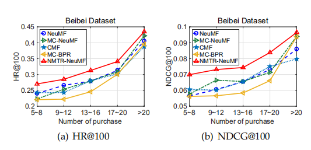

